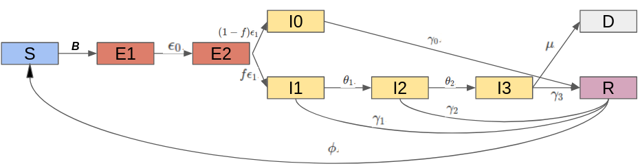
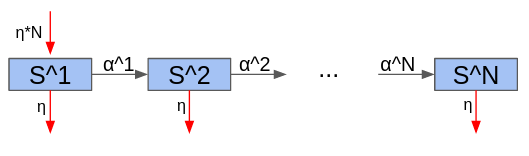

# Playing Around with Epi Models - Part 1


As a follow up to my last post, this is a detailed description of the SEIR model I built on top of [work](https://alhill.shinyapps.io/COVID19seir/) by Alsion Hill as a self-learning exercise.


Code for this project can be found [here](https://github.com/demirev/SEIR_COVID19), while an interactive dashboard is available [here](https://demirev.shinyapps.io/SIRinterventions/).


## Model Description - Age-specific SEIR Model

Individuals in this model are split up into $A$ age groups and 9 classes. All individuals start in the susceptible ($S$) class. Then they pass through two exposed class $E0$ and $E1$, where once in the second class they become infectious. Infected indivduals can be either asymptomatic ($I0$), mild ($I1$), severe ($I2$) or critical ($I3$). Alls of them can transmit the disease and all of them can either pass to the next stage or heal. Critical cases face a probability of dying and transitioning to the $D$ class. Recovered individuals transit to the $R$ class where they are immune. Optionally the user can specify a probability of losing immunity and transitioning back to the $S$ class. Thet transition dynamics are presented below:



Individuals age at a rate ensuring they spend the correct time in their age bracket. The aging rate for age bracket $i$ is defined as $1$ over the length of the bracket (and $0$ for the oldest bracket). In addition the user can specify a background non-epidemic death rate. In that case I also introduce a birth rate to keep the population constant. The death rate is the same across age groups in the dashboard (although in the source code it need not be) so it only serves to introduce a new flow of susceptibles and a possible endemic equilibrium.



The differential equations that governs the system are given below:

## ODE System
 
### Equations
* $\dot{S^{i}} = -\beta_{e}\sum_{j \in 1:A}w^{i,j}_e E_1^j \frac{S^i}{n^i} \sigma(t) -\beta_{0}\sum_{j \in 1:A}w^{i,j}_0 I_0^j \frac{S^i}{n^i} \sigma(t)-\beta_{1}\sum_{j \in 1:A}w^{i,j}_1 I_1^j \frac{S^i}{n^i} \sigma(t)-\beta_{2}\sum_{j \in 1:A}w^{i,j}_2 I_2^j \frac{S^i}{n^i} \sigma(t)-\beta_{3}\sum_{j \in 1:A}w^{i,j}_3 I_3^j \frac{S^i}{n^i} \sigma(t) +\alpha^{i-1} S^{i-1} -\alpha^i S^i - \eta_{-}^{i} S + \eta_{+}^{i} \sum_{j \in 1:A}n^i +\phi R^i$

* $\dot{E_0^i} = \beta_{e}\sum_{j \in 1:A}w^{i,j}_e E_1^i \frac{S^i}{n^i} \sigma(t) +\beta_{0}\sum_{j \in 1:A}w^{i,j}_0 I_0^i \frac{S^i}{n^i} \sigma(t) + \beta_{1}\sum_{j \in 1:A}w^{i,j}_1 I_1^i \frac{S^i}{n^i} \sigma(t) + \beta_{2}\sum_{j \in 1:A}w^{i,j}_2 I_2^i \frac{S^i}{n^i} \sigma(t) + \beta_{3}\sum_{j \in 1:A}w^{i,j}_3 I_3^i \frac{S^i}{n^i} -\epsilon_0 E_0^i \sigma(t) +\alpha^{i-1} E_0^{i-1} -\alpha^i E_0^i - \eta_{-}^{i} E_0^i$

* $\dot{E_1^i} = \epsilon_0 E_0^i - \epsilon_1 E_1^i + \alpha^{i-1} E_1^{i-1} - \alpha^i E_1^i -\eta_{-}^{i}E_1^i$

* $\dot{I_0^i} = f\epsilon_1 E_1^i - \gamma_0 I_0^i + \alpha^{i-1} I_0^{i-1} - \alpha^i I_0^i -\eta_{-}^i I_0^i$

* $\dot{I_1^i} = (1-f)\epsilon_1 E_1^i - \gamma_1 I_1^i - \theta_1 I_1^i + \alpha^{i-1} I_1^{i-1} - \alpha^i I_1^i -\eta_{-}^i I_1^i$

* $\dot{I_2^i} = \theta_1 I_1^i - \gamma_2 I_2^i - \theta_2 I_2^i + \alpha^{i-1} I_2^{i-1} - \alpha^i I_2^i -\eta_{-}^i I_2^i$

* $\dot{I_3^i} = \theta_2 I_2^i - \gamma_3 I_3^i - \mu I_3^i + \alpha^{i-1} I_3^{i-1} - \alpha^i I_3^i -\eta_{-}^i I_3^i$

* $\dot{R^i} = \gamma_1 I_1^i + \gamma_2 I_2^i + \gamma_3 I_3^i - \phi R^i + \alpha^{i-1} R^{i-1} - \alpha^i R^i -\eta_{-}^i R^i$

* $\dot{D^i}  = \mu I^i_3$

Where $i$ takes values in $1:A$ (i.e. one for each age group). Dotted values denote time derivatives.

### Variables
All variables below are vectors of length $A$, where the $i$-th element represents the number of that class in the $i$-th age group.
* $S$: Susceptible individuals
* $E_0$: Exposed to the virus but not yet infectious or symptomatic
* $E_1$: Exposed to the virust, already infectious but not yet symptomatic
* $I_0$: Infected individuals with no symptoms. These individuals can pass the virus but they do not pass to the more critical categories and will always heal completely at some point.
* $I_i$: Infected individuals in severity class $i$. Severity increases with $i$ and we assume individuals must pass through all previous classes
  * $I_1$: Mild infection 
  * $I_2$: Severe infection 
  * $I_3$: Critical infection 
* $R$: individuals who have recovered from disease and are now immune
* $D$: Dead individuals


### Parameters
* $\beta_e$ probability of infection given contact between individual of class $E_1$ and a susceptible individual.
* $\beta_i$ probability of infection given contact between individual of class $I_i$ and a susceptible individual.
* $w_{e}^{i,j}$ daily average number of contacts between an exposed individual of age group $i$ and age group $j$. The defintion for $w_0^{i,j}$, $w_1^{i,j}$, $w_2^{i,j}$, $w_3^{i,j}$. All these variables can be organised into matrices $W_e$, $W_0$, $W_1$, $W_2$, and $W_3$.
* $\eta_{-}$ vector of per age outside probability of unrelated death (in this dashboard all elements are the same)
* $\eta_{+}$ vector of birth rates. Everything except the first element is $0$ since all individuals are born in the first group
* $\alpha$ vector of aging rates. We define $\alpha^0$ to be $0$, and $X^0$ to be $0$ for all vectors $X
* $\epsilon_0$ probability of progression from class $E_0$ to $E_1$
* $\epsilon_i$ probability of progression from $E_1$ to $I_0$ or $I_1$
* $f$ fraction of progressed cases from $E1$ to $I_0$ (the complementary fraction $1-f$ progresses to $I_1$)
* $\gamma_i$ rate at which infected individuals in class $I_i$ recover from disease and become immune
* $\theta_i$ rate at which infected individuals in class $I_i$ progress to class $I_{i+1}$
* $\mu$ death rate for individuals in the most severe stage of disease
* $\sigma(t)$: Seasonal multiplier at time $t$.

All probabilities and rates are per day.

## Linking the model parameters to real-world disease specifics

### Clinical stages

* Mild infection - Hospitalization is not required (though in many countries such individuals are also hospitalized)
* Severe infection - Hospitalization and supplemental oxygen are generally required.
* Critical infection - Treatment in an ICU, often with mechanical ventilation, is required.

### Relating clinical observations to model parameters

To determine the model parameters consistent with current clinical data, we collect the following values from the slider values chosen by the user, and then use the formulas below to relate them to the rate parameters in the model. Note that the slider inputs for time intervals are average durations. 

* IncubPeriod:  Average incubation period, days
* DurMildInf: Average duration of mild infections, days
* FracMild: Average fraction of (symptomatic) infections that are mild
* FracSevere: Average fraction of (symptomatic) infections that are severe
* FracCritical: Average fraction of (symptomatic) infections that are critical
* CFR: Case fatality rate (fraction of infections that eventually result in death)
* DurHosp: Average duration of hospitalization (time to recovery) for individuals with severe infection, days
* TimeICUDeath: Average duration of ICU admission (until death or recovery), days

(Note g=$\gamma$)
```r
a=1/IncubPeriod
g1=(1/DurMildInf)*FracMild
theta1=(1/DurMildInf)-g1
g2=(1/DurHosp)-theta2
theta2=(1/DurHosp)*(FracCritical/(FracSevere+FracCritical))
mu=(1/TimeICUDeath)*(CFR/FracCritical)
g3=(1/TimeICUDeath)-mu
eta1=1/PresymPeriod
eta0=(IncubPeriod-PresymPeriod)^(-1)
f=FracAsym
g0=1/DurAsym
We = W
W0 = W
W1 = ContactFractionMild * W
W2 = ContactFractionSevere * W
W3 = ContactFractionCritical * W
```

Where $W$ is the contact matrix of healthy individuals defined by the inputs in the contacts tab. I assume exposed and asymptomatics don't change their contact behavior, while infections of different severity only conduct a fraction of the contacts of healthy individuals due to being sick at home or in hospital. The fractions are defined by the user.

## Assumptions

* This model is formulated as a system of differential equations and the output therefore represents the expected values of each quantity. It does not take into account stochastic events, and so the epidemic cannot go extinct even when it gets to very low values (except when an intervention is stopped, at which case the number of individuals in each state is rounded to the nearest integer). The model does not report the expected variance in the variables, which can sometimes be large. 
* Individuals must pass through a mild stage before reaching a severe or critical stage
* Individuals must pass through a severe stage before reaching a critical stage
* Only individuals in a critical stage die
* All individuals of a single age group have equal transmission rates and equal susceptibility to infection


